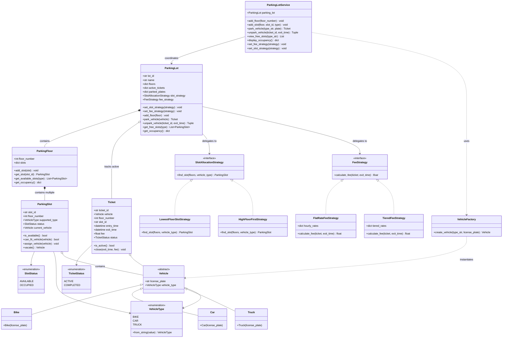

# UML Class Diagram & Relationship Documentation

This document describes the Object-Oriented design and relationships for the **Extensible Multi-Floor Parking Lot System**.

---

## Mermaid Class Diagram

---

## Real Code Relationships Explained

Every relationship in the diagram directly maps to a line of code:

1. **`ParkingLot` *-- `ParkingFloor` (Composition)**:
   - A parking lot owns its floors (`self.floors = {}`).
   - If the parking lot is destroyed, the floors cease to exist as parking entities.

2. **`ParkingFloor` *-- `ParkingSlot` (Composition)**:
   - A floor owns its designated slots (`self.slots = {}`).

3. **`ParkingSlot` o-- `Vehicle` (Aggregation)**:
   - A slot holds a reference to a parked vehicle (`self.current_vehicle`).
   - When the vehicle unparks, the vehicle continues to exist independently of the slot.

4. **`ParkingLot` o-- `Ticket` (Aggregation)**:
   - The parking lot maintains active tickets in `self.active_tickets`.
   - Tickets exist as historical records even after a vehicle unparks.

5. **`ParkingLot` --> `SlotAllocationStrategy` (Strategy Pattern)**:
   - The parking lot holds an instance of `SlotAllocationStrategy`.
   - When parking, it delegates the search for a free slot to `self.slot_strategy.find_slot(...)`.

6. **`ParkingLot` --> `FeeStrategy` (Strategy Pattern)**:
   - The parking lot holds an instance of `FeeStrategy`.
   - When unparking, it delegates pricing calculations to `self.fee_strategy.calculate_fee(...)`.

7. **`Bike`, `Car`, `Truck` --|> `Vehicle` (Inheritance & Polymorphism)**:
   - Subclasses inherit from the abstract base class `Vehicle` and set their specific `VehicleType`.

8. **`VehicleFactory` ..> `Vehicle` (Factory Pattern / Dependency)**:
   - `VehicleFactory.create_vehicle(...)` instantiates the correct subclass without leaking instantiation details to the service.

9. **`ParkingLotService` --> `ParkingLot` (Dependency / Coordination)**:
   - The service wraps business operations and provides a clean API for the driver and external callers.
